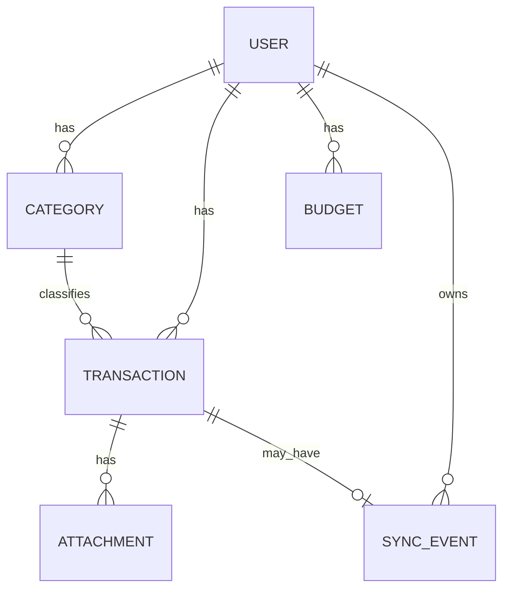

# MoneyTrack Pro v1 产品与技术方案

## 1. v1 产品边界

### 核心问题
首版只解决一个问题：
**单用户消费发生后，能够快速记账、查看账单、理解支出结构、控制月度预算。**

### v1 用户故事
1. 用户可以注册并登录自己的账号
2. 用户可以快速记录一笔支出或收入
3. 用户可按时间、分类、关键词查看交易
4. 用户可在首页看到本月支出、今日支出、预算剩余、最近交易
5. 用户可设置月度预算和分类预算
6. 用户可查看月度与分类统计
7. 用户可在离线时先记账，网络恢复后自动重试同步
8. 用户可导出历史记录

### 明确不在 v1
- 多用户协作
- 复杂年度预算与预测
- 多供应商 AI 报告
- 多端同步冲突仲裁
- 对象存储 CDN 全链路
- 社交/分享/企业审计

## 2. 生产级数据模型设计原则

### 2.1 通用审计字段
所有主表都必须包含：
- `id`
- `createdAt`
- `updatedAt`
- `deletedAt`

`deletedAt` 用于软删除，避免财务数据被物理删除后无法追溯。

### 2.2 金额设计
- 所有金额使用 **最小货币单位** 存储，例如“分”
- 数据库字段类型：`Int` 或 `BigInt` 建议在 v1 先用 `Int`，但保留升级路径
- 统一币种字段：`currencyCode`，v1 固定 `CNY`
- 金额展示一律在前端/服务层转换

### 2.3 单用户设计
v1 采用“单用户账号”模型，但数据模型仍然保留 `userId`，为后续多用户扩展留路。

## 3. 核心实体

### 3.1 User
用于本地账号登录与数据归属。

#### 关键字段
- `id`
- `email`
- `passwordHash`
- `displayName`
- `status`
- `lastLoginAt`
- `createdAt`
- `updatedAt`
- `deletedAt`

#### 说明
- v1 不做手机号短信验证，邮箱+密码即可
- 状态保留：ACTIVE / SUSPENDED / DELETED
- 为后续设备、会话、刷新令牌扩展预留

---

### 3.2 Category
用户记账分类。

#### 关键字段
- `id`
- `userId`
- `name`
- `icon`
- `color`
- `sortOrder`
- `isSystem`
- `transactionType`（EXPENSE / INCOME）
- `createdAt`
- `updatedAt`
- `deletedAt`

#### 说明
- 系统默认分类在初始化时创建
- 用户可复制、修改、排序、删除自定义分类
- 分类不直接硬删，避免已有账单断链

---

### 3.3 Transaction
核心账务实体。

#### 关键字段
- `id`
- `userId`
- `categoryId`
- `type`（EXPENSE / INCOME）
- `amount`
- `currencyCode`
- `occurredAt`
- `title`
- `note`
- `merchant`
- `tags`（建议 JSON 或独立关联表）
- `attachmentKey`
- `sourceDeviceId`
- `clientTxnId`
- `createdAt`
- `updatedAt`
- `deletedAt`

#### 说明
- `clientTxnId` 用于离线幂等提交，防止网络重试导致重复记录
- `sourceDeviceId` 为后续多端冲突解决保留标记
- `occurredAt` 表示消费真实发生时间，不是入库时间
- `attachmentKey` 预留图片附件，v1 可先支持本地或简单文件接口

---

### 3.4 Budget
预算主表。

#### 关键字段
- `id`
- `userId`
- `periodType`（MONTHLY / WEEKLY）
- `year`
- `month`
- `weekStart`
- `categoryId`（可空表示总预算）
- `amount`
- `currencyCode`
- `createdAt`
- `updatedAt`
- `deletedAt`

#### 说明
- v1 先支持：月度总预算 + 分类预算
- 周预算可作为扩展能力保留，避免首版复杂度过高
- 年度预算不进主模型，先用统计聚合方式覆盖

---

### 3.5 Attachment
账单附件。

#### 关键字段
- `id`
- `userId`
- `transactionId`
- `storageKey`
- `originalName`
- `mimeType`
- `sizeBytes`
- `createdAt`
- `deletedAt`

#### 说明
- v1 先支持图片
- 存储抽象保留：本地磁盘 -> 对象存储

---

### 3.6 SyncEvent
离线提交记录与重试队列。

#### 关键字段
- `id`
- `userId`
- `deviceId`
- `clientTxnId`
- `entityType`
- `entityId`
- `operation`
- `payload`
- `status`
- `retryCount`
- `processedAt`
- `createdAt`
- `updatedAt`

#### 说明
- 前端离线时生成 clientTxnId
- 上报后端做幂等处理
- 状态：PENDING / SUCCESS / FAILED / CONFLICT

## 4. ER 关系概览



## 5. 索引策略

### 必要索引
- `Transaction(userId, occurredAt)`
- `Transaction(userId, categoryId, occurredAt)`
- `Transaction(userId, type, occurredAt)`
- `Transaction(userId, clientTxnId)` unique
- `Category(userId, name)` partial unique where deleted
- `Budget(userId, year, month, categoryId)` unique
- `Attachment(transactionId)`
- `SyncEvent(userId, clientTxnId)`

### 查询重点
- 首页最近账单
- 按时间范围聚合
- 按分类聚合
- 预算与实际花费对比
- 搜索与筛选组合

## 6. API 设计原则

### 统一响应格式
```json
{
  "success": true,
  "data": {},
  "meta": {},
  "error": null
}
```

失败时：
```json
{
  "success": false,
  "data": null,
  "meta": null,
  "error": {
    "code": "VALIDATION_ERROR",
    "message": "金额格式不合法",
    "details": []
  }
}
```

### 错误码分层
- `AUTH_*`
- `VALIDATION_*`
- `TRANSACTION_*`
- `CATEGORY_*`
- `BUDGET_*`
- `EXPORT_*`
- `FILE_*`
- `SYSTEM_*`

### 核心 RESTful API

#### 认证
- `POST /api/v1/auth/register`
- `POST /api/v1/auth/login`
- `POST /api/v1/auth/logout`
- `GET /api/v1/auth/me`

#### 分类
- `POST /api/v1/categories`
- `GET /api/v1/categories`
- `GET /api/v1/categories/:id`
- `PUT /api/v1/categories/:id`
- `DELETE /api/v1/categories/:id`

#### 交易
- `POST /api/v1/transactions`
- `GET /api/v1/transactions`
- `GET /api/v1/transactions/:id`
- `PUT /api/v1/transactions/:id`
- `DELETE /api/v1/transactions/:id`
- `POST /api/v1/transactions/batch-delete`
- `POST /api/v1/transactions/export`

#### 预算
- `POST /api/v1/budgets`
- `GET /api/v1/budgets`
- `GET /api/v1/budgets/current`
- `PUT /api/v1/budgets/:id`
- `DELETE /api/v1/budgets/:id`

#### 统计
- `GET /api/v1/analytics/summary`
- `GET /api/v1/analytics/monthly`
- `GET /api/v1/analytics/category`
- `GET /api/v1/analytics/trend`

#### 附件
- `POST /api/v1/attachments`
- `GET /api/v1/attachments/:id`
- `DELETE /api/v1/attachments/:id`

#### 健康检查
- `GET /api/v1/health`

## 7. v1 验收标准
1. 后端 schema 与 API 可稳定演进，不必重构主模型
2. 金额计算、预算对比、分类统计均基于统一金额单位
3. 离线提交具备幂等键，不会因重试重复记账
4. 核心接口都具备统一校验、错误码和审计能力
5. 后续扩展 AI、多端、多用户时不破坏现有主体结构
